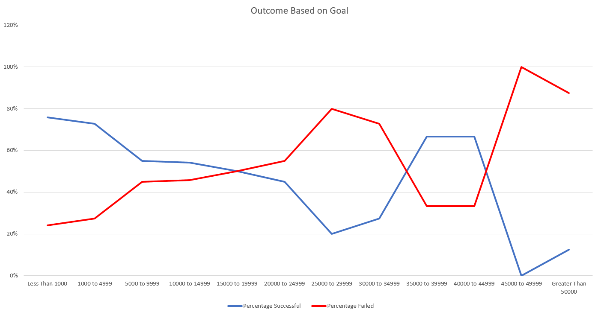

# Theater Kickstarter Analysis

## Overview of Project

Help the client, Louisa, crowdsource her play by analyzing Kickstarter data of past theater campaigns.

### Purpose

Using data from past Kickstarter campaigns, we are to determine the what amount of crowdfunding is needed and when is the optimal time to begin the campaign

## Analysis and Challenges

Raw Kickstarter data was obtained regarding a multitude of different crowdfunding campaigns encompassing a span of a few years. Our primary interest were focused on the Theater category, specifically the Plays sub-category. We wanted to know what the data showed for Plays that were successful and Plays that failed to reach their goal. The challenge was sorting through all the data, parsing what was relavant, and analyzing the portion we wanted. The results gave us a clear picture as to what factors lead to a successful Plays Kickstarter campaign.

### Analysis of Outcomes Based on Launch Date

One of the factors that leads to a successful campaign is timing the launch date. Based on the data, it was determined that a start date from April to August where more likely to reach the crowdfunding goal as shown in figure 1. In Louisa's case, we would recommend a start date between those months mentioned to achieve success.

*Figure 1. Theater Outcomes Based on Launch Date*

### Analysis of Outcomes Based on Goals

Another factor to consider is the crowdfunding goal amount. Based on the data, it shows that an amount ranging from $15,000 and below gave a successful results. Looking at the range closer, we can determine that the lower the goal amount from $15,000 the better the chance of successfully crowdfunding the campaign. The data also shows a successful range of between $35,000 to $44,999. Although the data shows a favorable chance of succeeding in this higher range, we would not recommend setting a goal this high without futher analysis in this range. Therefore, we would recommend Louisa consider a goal range of between $1,000 to $10,000 for a successful campaign.

*Figure 2. Outcome Based on Goal*

### Challenges and Difficulties Encountered

Part of the challenges and difficulties where sorting through all the Kickstarter data. In the raw data, many categories not related to theater where present during the sorting phase of the project. Although not a road block, it did provide a challenge with drilling down to the data we wanted. Another challenge encounted was converting dates from UNIX time to human readable time. Formulas to convert were required, but was not difficult to implement.

Link to raw data: [Kickstarter_Challenge-JPINPIN.xlsx](Kickstarter_Challenge-JPINPIN.xlsx)

## Results

### What are two conclusions you can draw about the Outcomes based on Launch Date?
Based on the data with regards to launch date, there are two conclusions. First, launching a theater campaign during anytime of the year has the likely chance of succeeding. At no point does a failed campaign outcome exceed a successful campaign outcome over all the months. Second, launching a successful campaign during the months April to August has a very high change of succeeding.

### What can you conclude about the Outcomes based on Goals?
For outcomes based on goals, the conclusion is that a range from $15,000 or less would likely produce a successful outcome. There is however a narrow high range that may have a chance of being successful. This is between the $35,000 to $44,999 range. Although successful, further analysis of the section is needed to understand what campaigns did to achieve success. Ignoring that section, the general trend is that a goal higher that $15,000 would lead to a failed campaign.

### What are some limitations of this dataset?
The dataset included all campaigns that were not in a theater category. The dataset was also limited to just Kickstarter and not any other crowdfunding source. In addition, the date range of the data was limited to 2009 to 2017. Having more years to analyize would give further insight to our project. Finally, the plays sub-category can also be further drilled down to genre to give a more targeted analysis on what genre people tend to fund the most.

### What are some other possible tables and/or graphs that we could create?
Other possibilities of tables and graphs that could be created include:
  - Country specific results
  - Most popular years for plays
  - Comonality of all failed campaigns
